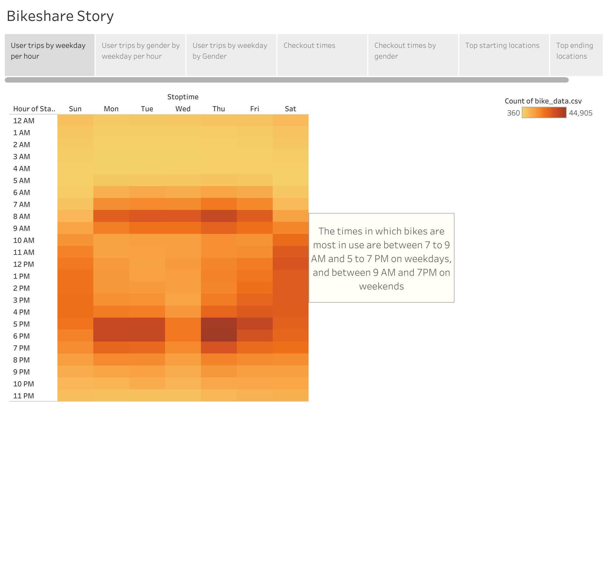
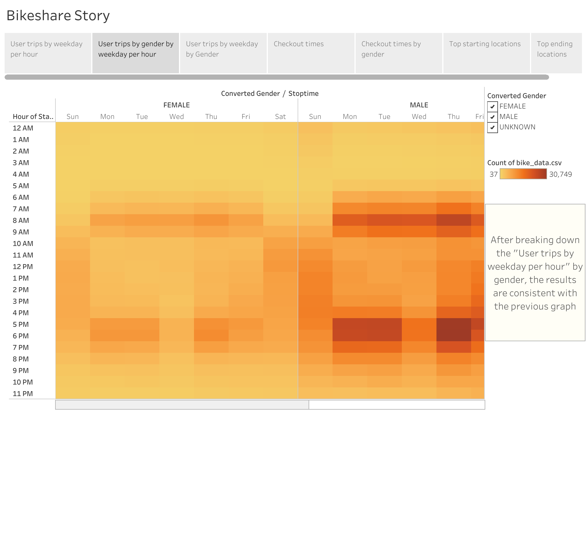
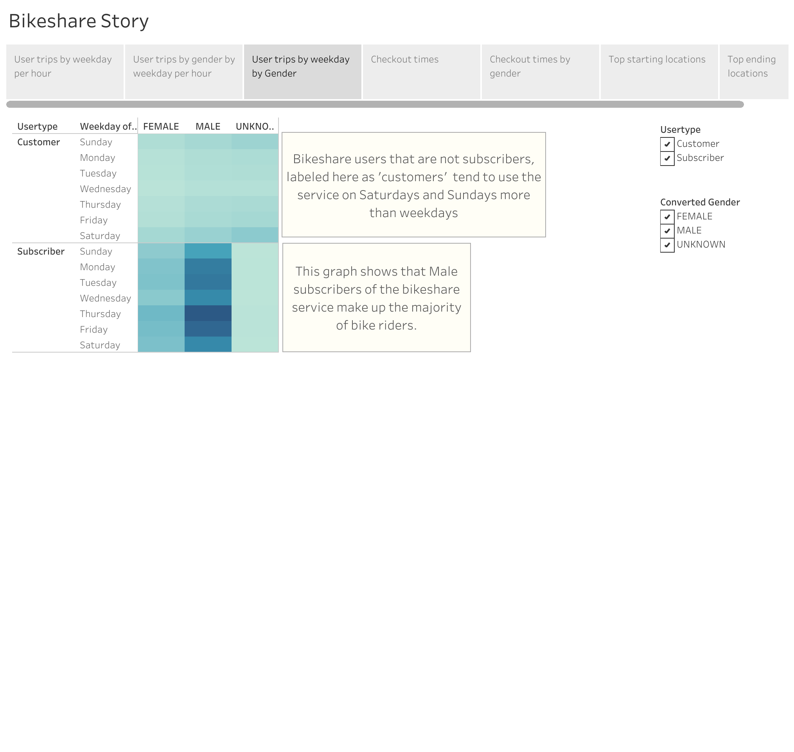
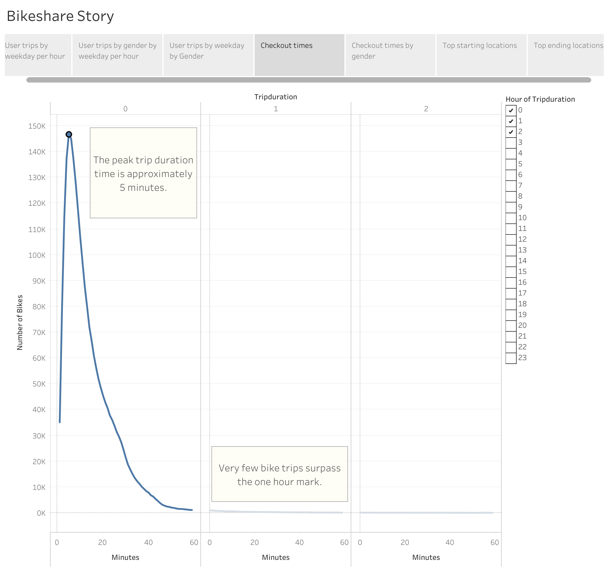
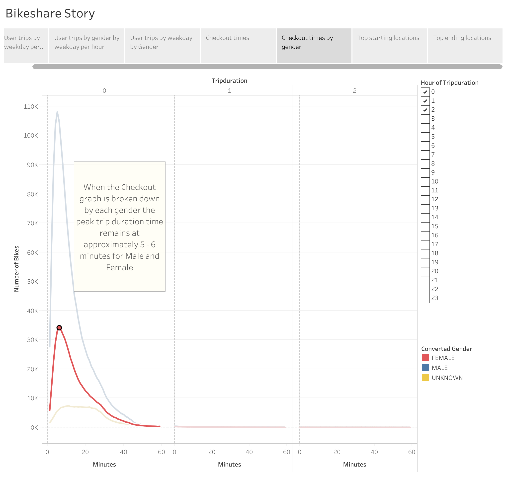
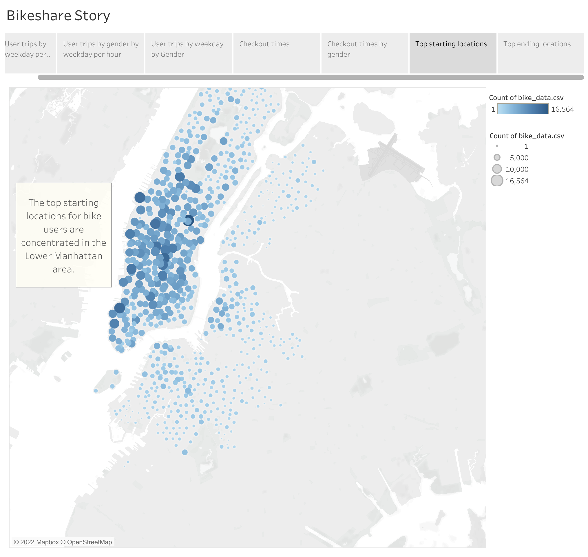
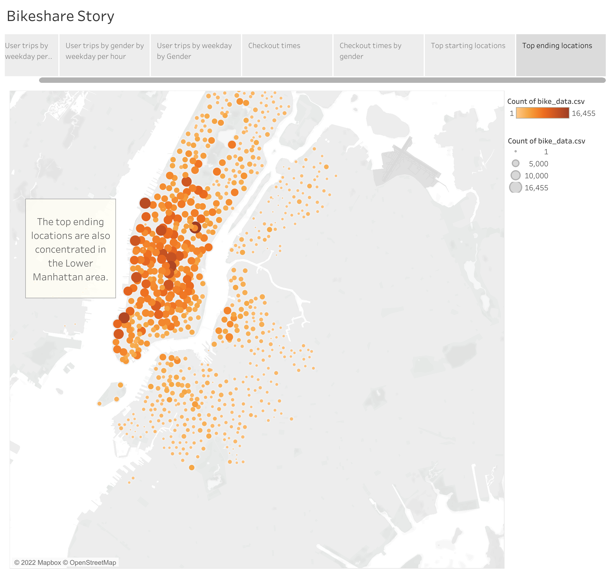

# Bikesharing

# Overview of the statistical analysis:

Using Tableau I was able to create story that depicts the usage of a bike sharing service in New York City, with the purpose of potentially expanding the service to Des Moines. In this report I will identify the days and times in which the service is most in use and I will show how this data differs between subscribers and customers of all genders. I will also show how long the bikes are typically checked out for. Lastly, I will identify the areas of the city in which the bike trips typically start and end. 

# Results:

The first image in this presentation shows the days of the week and times that bikes are checked out by all users. From this image we can see that bikes are usually checked out between 7 - 9 AM and 5 - 7 PM on weekdays. The bikes are also heavily used on the weekends between 9 AM - 7 PM. This data suggests that users are utilizing the service during the week to transport to and from work or school, and on the weekends for recreational purposes. 

The second image builds on the observations we made in the first image. The data has been filtered to show the days of the week and times that bikes are checked out by female users, male users, and users without gender information. The data here is consistent with the data in the first image: bikes are heavily used between 7 - 9 AM and 5 - 7 PM on weekdays and between 9 AM - 7 PM on weekends.

The third image shows that subscribers of the bikeshare service - specifically Male subscribers - make up the majority of bike riders on everyday of the week. As we can see from the top portion of the graph, bikeshare users that are not subscribers, labeled here as 'customers’, tend to use the service on Saturdays and Sundays more than on weekdays.
This shows that while subscribers depend on the bikeshare service everyday of the week, casual bike riders also benefit from the service and use the bikes recreationally on the weekends.

In the fourth image we can see that most users checkout the bikes for short periods of time. The peak trip duration time is approximately 5 minutes. The number of bikes that are checked out for periods of time longer than 5-6 minutes decreases sharply. Very few bike trips last up to an hour or longer. 

In the fifth image we can see a breakdown of the previous graph, detailing the trip durations of female bike riders, male bike riders, and bike rides without gender information. The data here is consistent with that seen in the previous graph. For both male and female bike riders, most trips only last 5-6 minutes. Data for bike rides without gender information do not have a distinct peak; for this demographic it appears that most bike rides last between 7-29 minutes. 

In the sixth image we are able to pinpoint the areas where most bike rides begin. We can see that the most popular starting points are concentrated in the Lower Manhattan area.

In the last image we are able to see the areas where most bike rides end. This map is very similar to the previous map. When observing these two maps we can conclude that most bike riders use the service to travel short distances, beginning and ending their trips in a small area - which is consistent with previous images. 

# Summary:

From this presentation we can see that a bikeshare service is beneficial for all types of people. Some users may subscribe to the service and depend on the bikes throughout the week as their main mode of transportation. Others may use the service more casually for recreational purposes on the weekends. This service does very well in a populated area containing many businesses, offices, and housing in close proximity to each other. It provides a very convenient service for people who need to travel short distances. 

To further observe the benefits of expending the bikeshare service I would suggest two more visualizations: I would recreate the Top Starting Locations and Top Ending Locations maps, and change the marker sizes to be dependent on trip duration, so we can see where bike riders tend to use the bikes for longer trips. 

